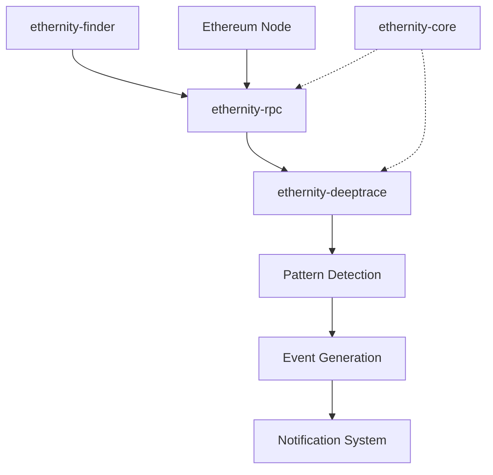

# Ethernity Workspace

## Visão Geral

O Ethernity é um workspace Rust para interação e análise avançada de transações blockchain no ambiente EVM (Ethereum Virtual Machine). O projeto é composto por quatro crates principais que trabalham em conjunto para fornecer capacidades abrangentes de monitoramento, análise e notificação de eventos blockchain.

## Arquitetura do Sistema

```
┌──────────────────────┐    ┌─────────────────────┐    ┌─────────────────────┐
│  ethernity-deeptrace │    │   ethernity-rpc     │    │  ethernity-core     │
│  (Análise Profunda)  │    │  (Cliente RPC)      │    │ (Tipos e Traits)    │
└──────────────────────┘    └─────────────────────┘    └─────────────────────┘
```

## Crates

### 🔧 [ethernity-core](./crates/ethernity-core/)
**Tipos e utilitários compartilhados**
- Tipos comuns para toda a workspace
- Traits fundamentais (RpcProvider, EventDetector, EventNotifier)
- Sistema de erros unificado
- Utilitários criptográficos e de conversão
- Funções para análise de contratos (ERC20/ERC721)

### 🌐 [ethernity-rpc](./crates/ethernity-rpc/)
**Cliente RPC otimizado**
- Conexões HTTP e WebSocket para nodes Ethereum
- Pool de conexões com balanceamento de carga
- Sistema de cache inteligente
- Retry automático e tratamento de erros
- Suporte a múltiplos transportes

### 🔎 [ethernity-finder](./crates/ethernity-finder/)
**Busca de nodes Ethereum**
- Consulta a API do Shodan
- Validação de `chainId` e métodos RPC
- Retorno de nodes compatíveis

### 🔍 [ethernity-deeptrace](./crates/ethernity-deeptrace/)
**Análise profunda de transações**
- Análise de call traces e execution paths
- Detecção de padrões complexos (MEV, rug pulls, ataques)
- Análise de fluxo de fundos e transferências
- Detectores especializados para diferentes tipos de eventos
- Gerenciamento avançado de memória


## Fluxo de Dados



## Casos de Uso

### 🛡️ Monitoramento de Segurança
- Detecção de ataques de reentrancy
- Identificação de sandwich attacks
- Monitoramento de rug pulls
- Análise de manipulação de preços

### 🤖 Análise MEV
- Detecção de arbitragem
- Identificação de frontrunning/backrunning
- Análise de liquidações
- Monitoramento de flash loans

### 📊 Análise de Mercado
- Rastreamento de grandes transferências
- Monitoramento de criação de tokens
- Análise de atividade DeFi
- Detecção de eventos de governança

### 🔔 Alertas e Notificações
- Alertas em tempo real para eventos críticos
- Notificações personalizáveis por tipo de evento
- Integração com sistemas de terceiros
- Filtragem avançada de eventos

## Instalação

### Pré-requisitos
- Rust 1.70+
- Acesso a um node Ethereum (Geth, Erigon, etc.)

### Build do Workspace
```bash
git clone https://github.com/ethernity/ethernity
cd ethernity
cargo build --release
```

### Executar Testes
```bash
cargo test --workspace
```

### Testes de Integração
```bash
# Configurar endpoints RPC nos arquivos de teste
python tests/rpc_integration_test.py
python tests/performance_test.py
```

## Configuração Rápida

### Cliente RPC Básico
```rust
use ethernity_rpc::*;

let config = RpcConfig::default();
let client = EthernityRpcClient::new(config).await?;
let block_number = client.get_block_number().await?;
```

### Análise de Transação
```rust
use ethernity_deeptrace::*;
use ethernity_rpc::*;

let rpc_client = Arc::new(EthernityRpcClient::new(config).await?);
let analyzer = DeepTraceAnalyzer::new(rpc_client, None);
let analysis = analyzer.analyze_transaction(tx_hash).await?;
```


## Licença

Dupla licença MIT/Apache-2.0

## Contribuição

Contribuições são bem-vindas! Por favor, consulte as diretrizes de contribuição em CONTRIBUTING.md.
Para manter o código consistente, siga também os [Princípios de Desenvolvimento](./docs/software_principles.md).

## Suporte

- 📖 [Documentação completa](./docs/)
- 🐛 [Issues](https://github.com/ethernity/ethernity/issues)
- 💬 [Discussões](https://github.com/ethernity/ethernity/discussions)
